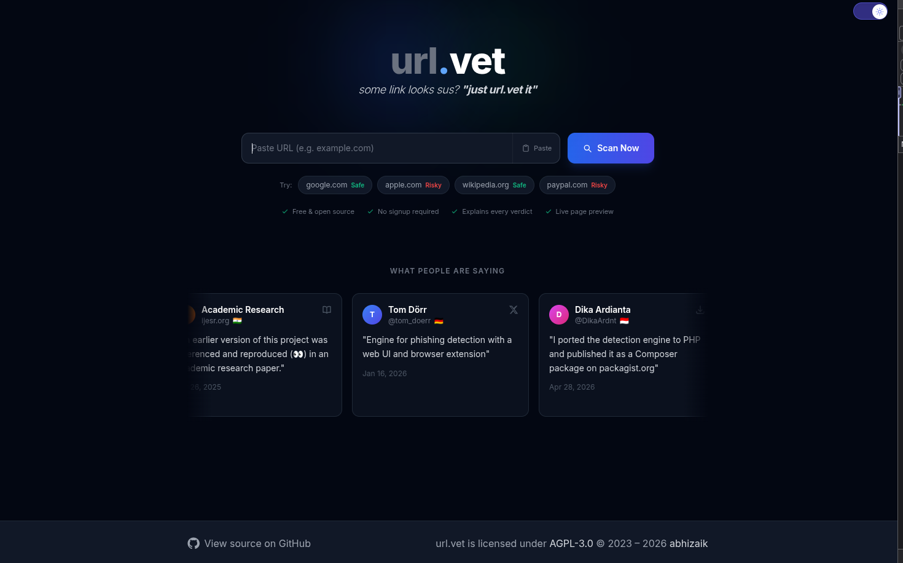
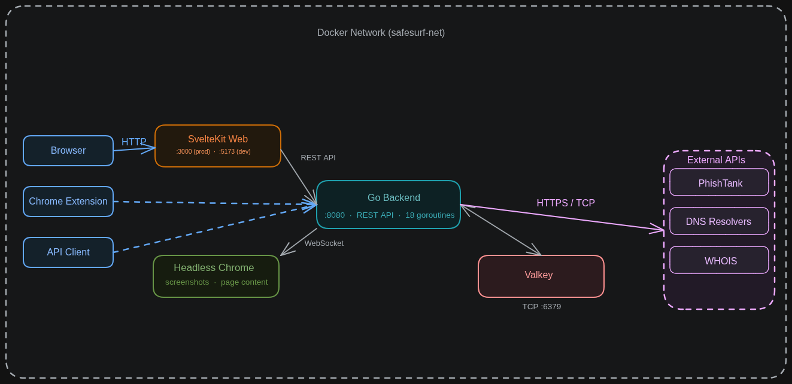
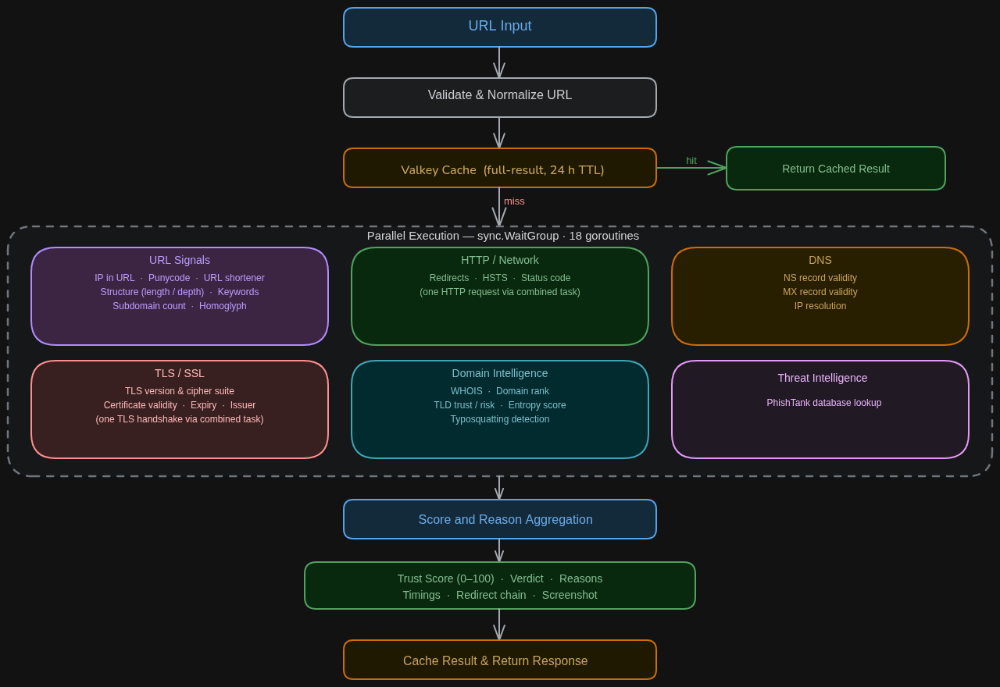

<p align="center">
  
</p>

<h1 align="center">The Url Mentalist</h1>

<p align="center">
  <strong>High-Performance, Real-Time URL Safety & Phishing Detection Engine</strong>
</p>

<p align="center">
  
  
  
  
  
  
</p>

---

## 🌟 Overview

**The Url Mentalist** is an advanced URL security intelligence and phishing detection engine. Designed with speed, depth, and full explainability in mind, it analyzes suspicious URLs in parallel across **7 signal categories** and **33 individual security checks**, producing a granular trust score, actionable verdict, and visual evidence.

Whether invoked through the modern **SvelteKit Web UI**, the lightweight **Chrome Extension**, or the high-throughput **Go REST API**, The Url Mentalist delivers comprehensive domain, network, structural, and threat intelligence in milliseconds.

---

## 🏛️ System Architecture



The application consists of four orchestrated containerized services running on a shared isolated network:

| Service | Technology | Role | Port |
| :--- | :--- | :--- | :--- |
| **Backend API** | Go 1.22+ (Gin) | Concurrent analysis pipeline, heuristic engine, cache orchestration | `:8080` |
| **Web Frontend** | SvelteKit + TailwindCSS | Responsive dashboard, dark/light theme, interactive inspection cards | `:3000` (prod) / `:5173` (dev) |
| **Screenshot Service** | Headless Chrome (Chromedp) | Automated sandbox visual webpage rendering | `:9222` |
| **Cache Store** | Valkey (Redis-compatible) | High-performance LRU caching with persistent state | `:6379` |

---

## ⚡ Analysis Pipeline & Detection Engine



When a URL is analyzed, the backend triggers **18 concurrent goroutines** executed in parallel with per-task recovery and isolated timeout controls:

1. **Reputation & Popularity**: Tranco/Cisco Top 1 Million global domain rank lookups.
2. **Threat Intelligence**: Real-time integration with PhishTank verified threat feeds.
3. **Homoglyph & Brand Impersonation**: Typosquatting detection, Levenshtein distance, Punycode / IDN spoofing, and 100+ targeted high-risk brand heuristics.
4. **Structural & Lexical Signals**: URL depth, character length, Shannon entropy, IP-in-hostname checks, and risky TLD flags.
5. **Infrastructure & Network Integrity**: DNS records (A, AAAA, MX, NS), DDNS provider detection, and AS / Hosting platform classification.
6. **Protocol & Security Headers**: Full TLS handshake validation, certificate issuer inspection, redirect chain traversal, and HSTS policy verification.
7. **Domain Registration & WHOIS/RDAP**: Domain creation date, age calculation, registrar metadata, and privacy shield detection.
8. **Sandbox Screenshotting**: Automated headless browser capture of the target destination.

---

## 🚀 Quick Start

### Option 1: Docker Compose (Recommended for Full Stack)

```bash
# Clone the repository
git clone https://github.com/AARYA-001/The-Url-Mentalist.git
cd The-Url-Mentalist

# Start the full stack (Backend, Frontend, Valkey, Chrome)
make dev-start
```

- **Web UI**: [http://localhost:5173](http://localhost:5173)
- **API Server**: [http://localhost:8080](http://localhost:8080)
- **Interactive Swagger Docs**: [http://localhost:8080/swagger/index.html](http://localhost:8080/swagger/index.html)

### Option 2: Local Development (Without Docker)

#### Prerequisites
- Go 1.22+
- Node.js 18+ and npm

#### 1. Start the Go Backend
```bash
cd server
cp .env.example .env
go run ./cmd/urlvet
```

#### 2. Start the SvelteKit Frontend
```bash
cd web/website
cp .env.sample .env
npm install
npm run dev
```

---

## 🔌 Chrome Extension

The Url Mentalist includes a ready-to-install browser extension in `web/chrome-extension`:

1. Open Chrome and navigate to `chrome://extensions/`.
2. Enable **Developer mode** (top-right toggle).
3. Click **Load unpacked** and select the [`web/chrome-extension`](web/chrome-extension) directory.
4. Inspect URLs in real time directly from your browser!

---

## 📡 REST API Reference

The backend exposes a full suite of granular and unified endpoints:

| Endpoint | Method | Description |
| :--- | :--- | :--- |
| `/api/v1/analyze` | `GET` | Complete unified URL analysis with score, verdict, reasons, and screenshot |
| `/api/v1/rank` | `GET` | Global top-1M domain ranking check |
| `/api/v1/ip/check` | `GET` | Check if URL uses a raw IP address |
| `/api/v1/ip/resolve` | `GET` | Resolve domain to A/AAAA IP records |
| `/api/v1/hsts` | `GET` | Inspect HSTS header status |
| `/api/v1/redirects` | `GET` | Trace full HTTP redirect chain |
| `/api/v1/punycode` | `GET` | Detect Unicode homoglyphs and Punycode encoding |
| `/api/v1/domain-info` | `GET` | Query RDAP/WHOIS domain registration & age |
| `/api/v1/screenshot` | `GET` | Render and return target webpage screenshot |
| `/health` | `GET` | Service liveness health check |
| `/metrics` | `GET` | Prometheus telemetry & scrapable metrics |

Full OpenAPI / Swagger interactive documentation is served at `/swagger/index.html`.

---

## 📁 Repository Structure

```
.
├── assets/                  # Architecture diagrams, logos, and UI demo assets
├── docker/                  # Docker Compose and Dockerfile specifications (dev & prod)
├── docs/                    # Detailed technical documentation
│   ├── api.md               # API reference & response schemas
│   ├── architecture.md      # Deep dive into system architecture & pipeline
│   ├── configuration.md     # Environment variables and configuration options
│   ├── deployment.md        # Production VPS, reverse proxy, and SSL guides
│   ├── security.md          # Authentication, token rotation, and SSRF prevention
│   └── testing.md           # Backend and frontend testing strategies
├── server/                  # Go backend source code
│   ├── cmd/urlvet/          # API entrypoint
│   ├── internal/
│   │   ├── analyzer/        # Concurrent orchestrator and score aggregator
│   │   ├── handler/         # HTTP handlers and router configuration
│   │   ├── service/         # Checks, threat feeds, WHOIS, rank, and screenshot services
│   │   └── constants/       # Heuristic datasets, brands, TLDs, and shorteners
├── web/
│   ├── website/             # SvelteKit 5 web dashboard application
│   ├── chrome-extension/    # Browser extension for instant URL inspection
│   └── static/              # Web icons and public assets
├── CITATION.cff             # Academic citation metadata
└── Makefile                 # Build, test, and container orchestration tasks
```

---

## 🧪 Testing & CI

Run the complete local CI suite (formatting, linting, type checks, and unit tests):

```bash
# Run backend tests
cd server && go test ./...

# Run frontend type check and tests
cd web/website && npm run check && npm run test

# Or run the all-in-one CI command
make ci
```

---

## 📜 Citation

If you use The Url Mentalist in academic work or research, please cite it using [`CITATION.cff`](CITATION.cff):

```bibtex
@software{The_Url_Mentalist,
  author = {Jadhav, Aarya},
  title = {The Url Mentalist: Real-Time URL Safety and Phishing Detection Engine},
  url = {https://github.com/AARYA-001/The-Url-Mentalist},
  year = {2026}
}
```

---

## 📄 License

This project is licensed under the [AGPL-3.0 License](LICENSE).
